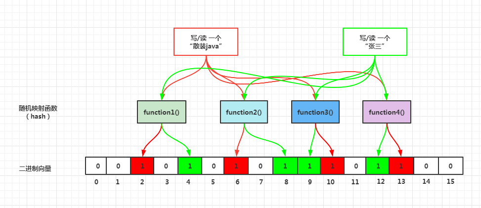

# 布隆过滤器使用演示

## 什么是布隆过滤器

布隆过滤器（Bloom Filter）是1970年由布隆提出的。 它实际上是一个很长的**二进制向量** 和**一系列随机映射函数** 。 布隆过滤器可以用于**检索一个元素是否在一个集合中** 。 它的优点是**
空间效率和查询时间都比一般的算法要好的多** ，缺点是有一定的**误识别率和删除困难** 。

> ps: 上面这句话可以理解为：有个二进制的**集合** ，里面存放的0和1，0代表不存在，1代表存在，可以通过一些定义好的**方法**
> 快速判断元素是否在集合中。内部逻辑如下图展示

## 布隆过滤器有哪些作用

> 由于布隆过滤器的特性，能够判断一个数据**可能在集合中** ，和一个数据**绝对不在集合中** ，所以他可以用于以下场景

1. 网页URL的去重（爬虫，避免爬取相同的 URL 地址）
2. 垃圾邮件的判别
3. 集合重复元素的判别
4. 查询加速（比如基于key-value的存储系统）
5. 数据库防止查询击穿，使用 BloomFilter 来减少不存在的行或列的磁盘查找（**缓存穿透** ）。
6. ...

## 演示一下布隆过滤器的用法

我这里演示的布隆过滤器的使用，是基于别的轮子

以下轮子可以使用

- Guava 示例 [GuavaBloomFilterTest](./src/test/java/top/bulk/bloom/demo/GuavaBloomFilterTest.java)
- HuTool
- Redisson 示例 [RedissonDemoTest](src/test/java/top/bulk/bloom/demo/RedissonDemoTest.java)
- 自己实现一个 示例 [BulkBloomFilter](src/main/java/top/bulk/bloom/bloom/BulkBloomFilter.java)

以及在业务场景的使用案例 [ProductController](src/main/java/top/bulk/bloom/top.bulk.lock.zk.controller/ProductController.java)

以下为项目中的使用流程

## 如何解决布隆过滤器无法删除数据的问题

1. 升级版的布隆过滤器（Counting Bloom Filter） 其原理为：

- 原理就是把位图的位 升级为计数器(Counter)
- 添加元素, 就给对应的Counter分别+1
- 删除元素, 就给对应的Counter分别减一
- 用多出几倍存储空间的代价, 来实现删除功能

2. 布谷鸟过滤器（Cuckoo filter）

## 项目启动

|技术栈|版本|
|---|---|
|Java|1.8|
|Spring Boot| 2.7.0|
|MySQL | 5.7|
|Maven | 3.8.3|
|Redis| 5.x|

1. 导入数据库 [sql](_db/demo.sql) 修改自己的数据库[配置信息](src/main/resources/application.yml)账号密码之类
2. 修改自己的 Redis [配置信息](src/main/resources/application.yml)账号密码之类
3. 启动项目 [SpringBootBloomFilterApplication](src/main/java/top/bulk/bloom/SpringBootBloomFilterApplication.java)
4. 一些测试用例 [httpRequest](_http/case-requests.http)