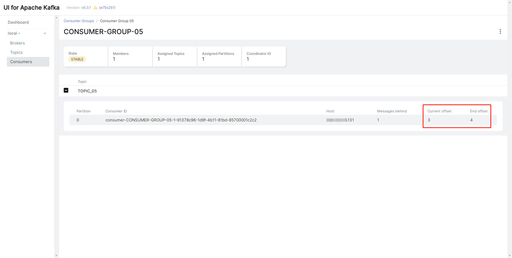

# Spring Boot + Kafka 消费进度提交 (ack)

Spring-Kafka Consumer 消费端，提供了丰富的消费者进度的提交机制，详情见下面对于 `AckMode` 的解释

### 配置

相较于之前普通的配置，这里的`application.yml`中多了两个配置
1. `spring.kafka.consumer.enable-auto-commit=false` ，使用 Spring-Kafka 的消费进度的提交机制。默认情况下，不添加该配置项也是可以的，因为 false 是默认值。
2. `spring.kafka.listener.ack-mode=MANUAL` ，使用 MANUAL 模式：调用时，先标记提交消费进度。等到当前消息被消费完成，然后在提交消费进度。

以下是关于提交类型枚举类 `AckMode` 的解释

```java
public static enum AckMode {

    // ========== 自动提交 ==========

    /**
     * 每条消息被消费完成后，自动提交
     */
    RECORD,

    /**
     * 每一次消息被消费完成后，在下次拉取消息之前，自动提交
     */
    BATCH,

    /**
     * 达到一定时间间隔后，自动提交。
     * 不过要注意，它并不是一到就立马提交，如果此时正在消费某一条消息，需要等这条消息被消费完成，才能提交消费进度。
     */
    TIME,

    /**
     * 消费成功的消息数到达一定数量后，自动提交。
     * 不过要注意，它并不是一到就立马提交，如果此时正在消费某一条消息，需要等这条消息被消费完成，才能提交消费进度。
     */
    COUNT,

    /**
     *  TIME 和 COUNT 的结合体，满足任一都会自动提交。
     */
    COUNT_TIME,

    // ========== 手动提交 ==========

    /**
     * 调用时，先标记提交消费进度。等到当前消息被消费完成，然后在提交消费进度。
     */

    /**
     * 调用时，立即提交消费进度。
     */
    MANUAL_IMMEDIATE;
}
```

### 生产者

```java
@Component
public class KafkaProducer05 {
    @Resource
    private KafkaTemplate<Object, Object> kafkaTemplate;

    public SendResult<Object, Object> syncSend(Integer id) throws ExecutionException, InterruptedException {
        KafkaMessage05 message = new KafkaMessage05();
        message.setId(id);
        // 同步发送消息，使用 ListenableFuture 对象的 get() 方法，阻塞等待发送结果，从而实现同步的效果
        return kafkaTemplate.send(KafkaMessage05.TOPIC, message).get();
    }
}
```

### 消费者

```java
@Component
@Slf4j
public class KafkaConsumer05 {

    @KafkaListener(topics = KafkaMessage05.TOPIC, groupId = KafkaMessage05.GROUP_ID)
    public void onMessage(KafkaMessage05 message, Acknowledgment acknowledgment) {
        log.info("[{}][KafkaConsumer05][线程编号:{} 消息内容：{}]", LocalDateTime.now(), Thread.currentThread().getId(), message);
        // 这里执行相应的业务逻辑

        // 提交消费进度
        if (message.getId() % 2 == 1) {
            acknowledgment.acknowledge();
            log.info("[{}][KafkaConsumer05]提交ack[id:{}]", LocalDateTime.now(), message.getId());
        } else {
            // 且当前消费线程在阻塞指定sleep（如下3000毫秒）后重新调用poll获取待消费消息（包括之前poll被抛弃的消息）
            // acknowledgment.nack(3000);
        }
        // 注意观察Kafka-ui 的 Current offset 、	End offset
        // 其实这里的确认指的是 当前消息（及之前的消息）offset均已被消费完成
    }
}
```

### 单元测试

```java
@SpringBootTest
@Slf4j
class KafkaProducer05Test {

    @Resource
    KafkaProducer05 kafkaProducer05;

    @Test
    void mock() throws InterruptedException, ExecutionException {
        // 充当多副本
        new CountDownLatch(1).await();
    }

    @Test
    void syncSend() throws InterruptedException, ExecutionException {
        log.info("[{}][testASyncSend][开始执行]", LocalDateTime.now());
        // 发送十条消息测试
        for (int i = 1; i <= 4; i++) {
            kafkaProducer05.syncSend(i);
        }
        // 注意观察Kafka-ui 的 Current offset 、	End offset
        // 其实这里的确认指的是 当前消息（及之前的消息）offset均已被消费完成
        // 可以参考 README.md 文件中的图
        new CountDownLatch(1).await();
    }
}
```

控制台输出为
```text
2023-03-22 14:59:01.845  INFO 7864 --- [           main] t.b.m.k.a.producer.KafkaProducer05Test   : [2023-03-22T14:59:01.845][testASyncSend][开始执行]
2023-03-22 14:59:02.442  INFO 7864 --- [ntainer#0-0-C-1] t.b.m.k.ack.consumer.KafkaConsumer05     : [2023-03-22T14:59:02.442][KafkaConsumer05][线程编号:14 消息内容：KafkaMessage05(id=1)]
2023-03-22 14:59:02.443  INFO 7864 --- [ntainer#0-0-C-1] t.b.m.k.ack.consumer.KafkaConsumer05     : [2023-03-22T14:59:02.443][KafkaConsumer05]提交ack[id:1]
2023-03-22 14:59:02.443  INFO 7864 --- [ntainer#0-0-C-1] t.b.m.k.ack.consumer.KafkaConsumer05     : [2023-03-22T14:59:02.443][KafkaConsumer05][线程编号:14 消息内容：KafkaMessage05(id=2)]
2023-03-22 14:59:02.443  INFO 7864 --- [ntainer#0-0-C-1] t.b.m.k.ack.consumer.KafkaConsumer05     : [2023-03-22T14:59:02.443][KafkaConsumer05][线程编号:14 消息内容：KafkaMessage05(id=3)]
2023-03-22 14:59:02.443  INFO 7864 --- [ntainer#0-0-C-1] t.b.m.k.ack.consumer.KafkaConsumer05     : [2023-03-22T14:59:02.443][KafkaConsumer05]提交ack[id:3]
2023-03-22 14:59:02.443  INFO 7864 --- [ntainer#0-0-C-1] t.b.m.k.ack.consumer.KafkaConsumer05     : [2023-03-22T14:59:02.443][KafkaConsumer05][线程编号:14 消息内容：KafkaMessage05(id=4)]

```

### 测试之后的效果图

