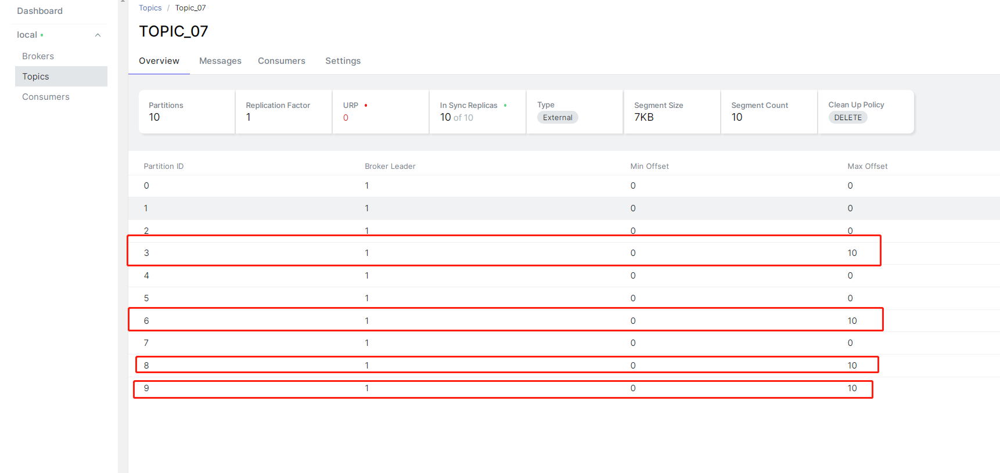

# Spring Boot + Kafka 顺序消费


Spring-Kafka 在 Consumer 消费消息时，天然就支持按照 Topic 下的 Partition 下的消息，顺序消费

那么此时，我们只需要考虑将 Producer 将相关联的消息发送到 Topic 下的相同的 Partition 即可。

只要我们发送消息时，指定了消息的 key ，Producer 则会根据 key 的哈希值取模来获取到其在 Topic 下对应的 Partition

### 配置
配置和之前示例相同，无特殊配置 参考 `application.yml`

这里我们自己创建了一个 10 Partition 的 Topic ,为了更好的演示 

```java
@Configuration
public class KafkaConfiguration {
    /**
     * 创建一个  Topic ，指定分区 10
     */
    @Bean
    public NewTopic initialTopic() {
        return new NewTopic(KafkaMessage07.TOPIC, 10, (short) 1);
    }
}
```

### 生产者
和普通的发送有所不通的地方在 `kafkaTemplate.send(KafkaMessage07.TOPIC, id, message).get();` 这里指定了消息的 key
并且，是同步 get()

```java
@Component
@Slf4j
public class KafkaProducer07 {
    @Resource
    private KafkaTemplate<Object, Object> kafkaTemplate;

    public SendResult<Object, Object> asyncSend(String id, String msg) throws ExecutionException, InterruptedException {
        KafkaMessage07 message = new KafkaMessage07();
        message.setId(id);
        message.setMsg(msg);
        // 以 id 作为第二个参数 消息的key， 指定了消息的 key ，Producer 则会根据 key 的哈希值取模来获取到其在 Topic 下对应的 Partition
        return kafkaTemplate.send(KafkaMessage07.TOPIC, id, message).get();
    }

}
```

### 消费者

```java
@Component
@Slf4j
public class KafkaConsumer07 {

    @KafkaListener(topics = KafkaMessage07.TOPIC, groupId = KafkaMessage07.GROUP_ID)
    public void onMessage(KafkaMessage07 message) throws InterruptedException {
        log.info("[{}][KafkaConsumer07][线程编号:{} 消息内容：{}]", LocalDateTime.now(), Thread.currentThread().getId(), message);
        // 这里执行相应的业务逻辑
        // 这里随机睡一会，模拟业务处理时候的耗时
        long l = new Random(1000).nextLong();
        TimeUnit.MILLISECONDS.sleep(l);
    }
}
```

### 单元测试

```java
@SpringBootTest
@Slf4j
class KafkaProducer07Test {

    @Resource
    KafkaProducer07 kafkaProducer07;

    @Test
    void mock() throws InterruptedException, ExecutionException {
        log.info("[{}][mock][开始执行]", LocalDateTime.now());
        // 模拟多个副本竞争
        new CountDownLatch(1).await();
    }

    @Test
    void asyncSend() throws InterruptedException, ExecutionException {
        log.info("[{}][testASyncSend][开始执行]", LocalDateTime.now());
        String id = UUID.randomUUID().toString();
        // 模拟每个 key 中扔 10 个数据，看看效果
        for (int i = 0; i < 10; i++) {
            for (int j = 0; j < 4; j++) {
                kafkaProducer07.asyncSend(String.valueOf(j), " 编号：" + j + " 第：" + i + " 条消息");
            }
        }

        // 主要观察消费者的打印,是多个线程并发去处理的
        TimeUnit.SECONDS.sleep(2);
    }
}
```


### 单元测试

按照单元测试，可以发现，我们的消息，被投递到了四个 Partition 中，每个中都有 10 个消息



控制台输出入下,可以看到，编号相同的消息，消费顺序是有序的

```text
2023-03-27 17:40:09.039  INFO 9800 --- [ntainer#0-0-C-1] t.b.m.k.s.consumer.KafkaConsumer07       : [2023-03-27T17:40:09.039][KafkaConsumer07][线程编号:15 消息内容：KafkaMessage07(id=0, msg= 编号：0 第：0 条消息)]
2023-03-27 17:40:09.082  INFO 9800 --- [ntainer#0-0-C-1] t.b.m.k.s.consumer.KafkaConsumer07       : [2023-03-27T17:40:09.082][KafkaConsumer07][线程编号:15 消息内容：KafkaMessage07(id=3, msg= 编号：3 第：0 条消息)]
2023-03-27 17:40:09.082  INFO 9800 --- [ntainer#0-0-C-1] t.b.m.k.s.consumer.KafkaConsumer07       : [2023-03-27T17:40:09.082][KafkaConsumer07][线程编号:15 消息内容：KafkaMessage07(id=0, msg= 编号：0 第：1 条消息)]
2023-03-27 17:40:09.082  INFO 9800 --- [ntainer#0-0-C-1] t.b.m.k.s.consumer.KafkaConsumer07       : [2023-03-27T17:40:09.082][KafkaConsumer07][线程编号:15 消息内容：KafkaMessage07(id=2, msg= 编号：2 第：0 条消息)]
2023-03-27 17:40:09.082  INFO 9800 --- [ntainer#0-0-C-1] t.b.m.k.s.consumer.KafkaConsumer07       : [2023-03-27T17:40:09.082][KafkaConsumer07][线程编号:15 消息内容：KafkaMessage07(id=1, msg= 编号：1 第：0 条消息)]
2023-03-27 17:40:09.123  INFO 9800 --- [ntainer#0-0-C-1] t.b.m.k.s.consumer.KafkaConsumer07       : [2023-03-27T17:40:09.123][KafkaConsumer07][线程编号:15 消息内容：KafkaMessage07(id=1, msg= 编号：1 第：1 条消息)]
2023-03-27 17:40:09.162  INFO 9800 --- [ntainer#0-0-C-1] t.b.m.k.s.consumer.KafkaConsumer07       : [2023-03-27T17:40:09.162][KafkaConsumer07][线程编号:15 消息内容：KafkaMessage07(id=2, msg= 编号：2 第：1 条消息)]
2023-03-27 17:40:09.202  INFO 9800 --- [ntainer#0-0-C-1] t.b.m.k.s.consumer.KafkaConsumer07       : [2023-03-27T17:40:09.202][KafkaConsumer07][线程编号:15 消息内容：KafkaMessage07(id=3, msg= 编号：3 第：1 条消息)]
2023-03-27 17:40:09.241  INFO 9800 --- [ntainer#0-0-C-1] t.b.m.k.s.consumer.KafkaConsumer07       : [2023-03-27T17:40:09.241][KafkaConsumer07][线程编号:15 消息内容：KafkaMessage07(id=0, msg= 编号：0 第：2 条消息)]
2023-03-27 17:40:09.281  INFO 9800 --- [ntainer#0-0-C-1] t.b.m.k.s.consumer.KafkaConsumer07       : [2023-03-27T17:40:09.281][KafkaConsumer07][线程编号:15 消息内容：KafkaMessage07(id=1, msg= 编号：1 第：2 条消息)]
2023-03-27 17:40:09.322  INFO 9800 --- [ntainer#0-0-C-1] t.b.m.k.s.consumer.KafkaConsumer07       : [2023-03-27T17:40:09.322][KafkaConsumer07][线程编号:15 消息内容：KafkaMessage07(id=3, msg= 编号：3 第：2 条消息)]
2023-03-27 17:40:09.322  INFO 9800 --- [ntainer#0-0-C-1] t.b.m.k.s.consumer.KafkaConsumer07       : [2023-03-27T17:40:09.322][KafkaConsumer07][线程编号:15 消息内容：KafkaMessage07(id=2, msg= 编号：2 第：2 条消息)]
2023-03-27 17:40:09.362  INFO 9800 --- [ntainer#0-0-C-1] t.b.m.k.s.consumer.KafkaConsumer07       : [2023-03-27T17:40:09.361][KafkaConsumer07][线程编号:15 消息内容：KafkaMessage07(id=0, msg= 编号：0 第：3 条消息)]
2023-03-27 17:40:09.402  INFO 9800 --- [ntainer#0-0-C-1] t.b.m.k.s.consumer.KafkaConsumer07       : [2023-03-27T17:40:09.401][KafkaConsumer07][线程编号:15 消息内容：KafkaMessage07(id=1, msg= 编号：1 第：3 条消息)]
2023-03-27 17:40:09.441  INFO 9800 --- [ntainer#0-0-C-1] t.b.m.k.s.consumer.KafkaConsumer07       : [2023-03-27T17:40:09.441][KafkaConsumer07][线程编号:15 消息内容：KafkaMessage07(id=2, msg= 编号：2 第：3 条消息)]
2023-03-27 17:40:09.482  INFO 9800 --- [ntainer#0-0-C-1] t.b.m.k.s.consumer.KafkaConsumer07       : [2023-03-27T17:40:09.481][KafkaConsumer07][线程编号:15 消息内容：KafkaMessage07(id=3, msg= 编号：3 第：3 条消息)]
2023-03-27 17:40:09.522  INFO 9800 --- [ntainer#0-0-C-1] t.b.m.k.s.consumer.KafkaConsumer07       : [2023-03-27T17:40:09.522][KafkaConsumer07][线程编号:15 消息内容：KafkaMessage07(id=0, msg= 编号：0 第：4 条消息)]
2023-03-27 17:40:09.562  INFO 9800 --- [ntainer#0-0-C-1] t.b.m.k.s.consumer.KafkaConsumer07       : [2023-03-27T17:40:09.562][KafkaConsumer07][线程编号:15 消息内容：KafkaMessage07(id=1, msg= 编号：1 第：4 条消息)]
2023-03-27 17:40:09.604  INFO 9800 --- [ntainer#0-0-C-1] t.b.m.k.s.consumer.KafkaConsumer07       : [2023-03-27T17:40:09.604][KafkaConsumer07][线程编号:15 消息内容：KafkaMessage07(id=2, msg= 编号：2 第：4 条消息)]
2023-03-27 17:40:09.644  INFO 9800 --- [ntainer#0-0-C-1] t.b.m.k.s.consumer.KafkaConsumer07       : [2023-03-27T17:40:09.644][KafkaConsumer07][线程编号:15 消息内容：KafkaMessage07(id=3, msg= 编号：3 第：4 条消息)]
2023-03-27 17:40:09.685  INFO 9800 --- [ntainer#0-0-C-1] t.b.m.k.s.consumer.KafkaConsumer07       : [2023-03-27T17:40:09.685][KafkaConsumer07][线程编号:15 消息内容：KafkaMessage07(id=0, msg= 编号：0 第：5 条消息)]
2023-03-27 17:40:09.685  INFO 9800 --- [ntainer#0-0-C-1] t.b.m.k.s.consumer.KafkaConsumer07       : [2023-03-27T17:40:09.685][KafkaConsumer07][线程编号:15 消息内容：KafkaMessage07(id=1, msg= 编号：1 第：5 条消息)]
2023-03-27 17:40:09.725  INFO 9800 --- [ntainer#0-0-C-1] t.b.m.k.s.consumer.KafkaConsumer07       : [2023-03-27T17:40:09.725][KafkaConsumer07][线程编号:15 消息内容：KafkaMessage07(id=2, msg= 编号：2 第：5 条消息)]
2023-03-27 17:40:09.765  INFO 9800 --- [ntainer#0-0-C-1] t.b.m.k.s.consumer.KafkaConsumer07       : [2023-03-27T17:40:09.765][KafkaConsumer07][线程编号:15 消息内容：KafkaMessage07(id=3, msg= 编号：3 第：5 条消息)]
2023-03-27 17:40:09.805  INFO 9800 --- [ntainer#0-0-C-1] t.b.m.k.s.consumer.KafkaConsumer07       : [2023-03-27T17:40:09.805][KafkaConsumer07][线程编号:15 消息内容：KafkaMessage07(id=0, msg= 编号：0 第：6 条消息)]
2023-03-27 17:40:09.844  INFO 9800 --- [ntainer#0-0-C-1] t.b.m.k.s.consumer.KafkaConsumer07       : [2023-03-27T17:40:09.844][KafkaConsumer07][线程编号:15 消息内容：KafkaMessage07(id=1, msg= 编号：1 第：6 条消息)]
2023-03-27 17:40:09.884  INFO 9800 --- [ntainer#0-0-C-1] t.b.m.k.s.consumer.KafkaConsumer07       : [2023-03-27T17:40:09.884][KafkaConsumer07][线程编号:15 消息内容：KafkaMessage07(id=2, msg= 编号：2 第：6 条消息)]
2023-03-27 17:40:09.925  INFO 9800 --- [ntainer#0-0-C-1] t.b.m.k.s.consumer.KafkaConsumer07       : [2023-03-27T17:40:09.925][KafkaConsumer07][线程编号:15 消息内容：KafkaMessage07(id=3, msg= 编号：3 第：6 条消息)]
2023-03-27 17:40:09.964  INFO 9800 --- [ntainer#0-0-C-1] t.b.m.k.s.consumer.KafkaConsumer07       : [2023-03-27T17:40:09.964][KafkaConsumer07][线程编号:15 消息内容：KafkaMessage07(id=0, msg= 编号：0 第：7 条消息)]
2023-03-27 17:40:10.005  INFO 9800 --- [ntainer#0-0-C-1] t.b.m.k.s.consumer.KafkaConsumer07       : [2023-03-27T17:40:10.005][KafkaConsumer07][线程编号:15 消息内容：KafkaMessage07(id=1, msg= 编号：1 第：7 条消息)]
2023-03-27 17:40:10.046  INFO 9800 --- [ntainer#0-0-C-1] t.b.m.k.s.consumer.KafkaConsumer07       : [2023-03-27T17:40:10.046][KafkaConsumer07][线程编号:15 消息内容：KafkaMessage07(id=2, msg= 编号：2 第：7 条消息)]
2023-03-27 17:40:10.088  INFO 9800 --- [ntainer#0-0-C-1] t.b.m.k.s.consumer.KafkaConsumer07       : [2023-03-27T17:40:10.088][KafkaConsumer07][线程编号:15 消息内容：KafkaMessage07(id=3, msg= 编号：3 第：7 条消息)]
2023-03-27 17:40:10.129  INFO 9800 --- [ntainer#0-0-C-1] t.b.m.k.s.consumer.KafkaConsumer07       : [2023-03-27T17:40:10.129][KafkaConsumer07][线程编号:15 消息内容：KafkaMessage07(id=0, msg= 编号：0 第：8 条消息)]
2023-03-27 17:40:10.129  INFO 9800 --- [ntainer#0-0-C-1] t.b.m.k.s.consumer.KafkaConsumer07       : [2023-03-27T17:40:10.129][KafkaConsumer07][线程编号:15 消息内容：KafkaMessage07(id=1, msg= 编号：1 第：8 条消息)]
2023-03-27 17:40:10.169  INFO 9800 --- [ntainer#0-0-C-1] t.b.m.k.s.consumer.KafkaConsumer07       : [2023-03-27T17:40:10.169][KafkaConsumer07][线程编号:15 消息内容：KafkaMessage07(id=2, msg= 编号：2 第：8 条消息)]
2023-03-27 17:40:10.209  INFO 9800 --- [ntainer#0-0-C-1] t.b.m.k.s.consumer.KafkaConsumer07       : [2023-03-27T17:40:10.209][KafkaConsumer07][线程编号:15 消息内容：KafkaMessage07(id=3, msg= 编号：3 第：8 条消息)]
2023-03-27 17:40:10.249  INFO 9800 --- [ntainer#0-0-C-1] t.b.m.k.s.consumer.KafkaConsumer07       : [2023-03-27T17:40:10.249][KafkaConsumer07][线程编号:15 消息内容：KafkaMessage07(id=0, msg= 编号：0 第：9 条消息)]
2023-03-27 17:40:10.288  INFO 9800 --- [ntainer#0-0-C-1] t.b.m.k.s.consumer.KafkaConsumer07       : [2023-03-27T17:40:10.288][KafkaConsumer07][线程编号:15 消息内容：KafkaMessage07(id=1, msg= 编号：1 第：9 条消息)]
2023-03-27 17:40:10.328  INFO 9800 --- [ntainer#0-0-C-1] t.b.m.k.s.consumer.KafkaConsumer07       : [2023-03-27T17:40:10.328][KafkaConsumer07][线程编号:15 消息内容：KafkaMessage07(id=2, msg= 编号：2 第：9 条消息)]
2023-03-27 17:40:10.368  INFO 9800 --- [ntainer#0-0-C-1] t.b.m.k.s.consumer.KafkaConsumer07       : [2023-03-27T17:40:10.368][KafkaConsumer07][线程编号:15 消息内容：KafkaMessage07(id=3, msg= 编号：3 第：9 条消息)]

```