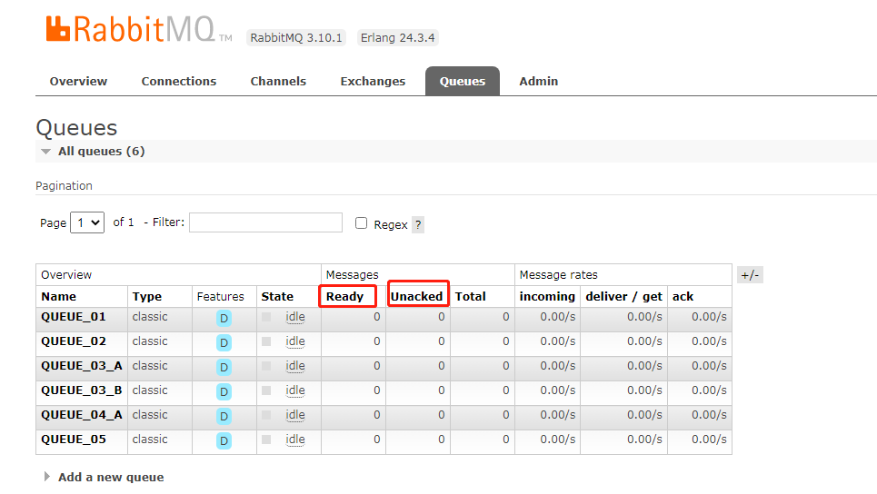
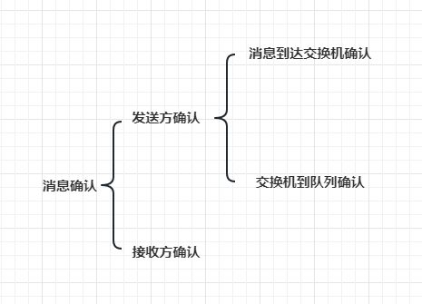

# Spring Boot 集成 RabbitMQ 消费者 ACK 功能

本模块是对于 RabbitMQ 消费者 ACK 功能的详细代码

## 基础介绍

为了保证消息从队列可靠的达到消费者，RabbitMQ 提供了消息确认机制（Message Acknowledgement）。 消费者在订阅队列时，可以指定 autoAck 参数，当 autoAck 参数等于 false 时，
RabbitMQ 会等待消费者显式地回复确认信号后才从内存（或者磁盘）中移除消息（实际上是先打上删除标记，之后在删除）。 当 autoAck 参数等于 true 时，RabbitMQ
会自动把发送出去的消息置为确认，然后从内存（或者磁盘）中删除，而不管消费者是否真正地消费到了这些消息。

采用消息确认机制后，只要设置 autoAck 参数为 false，消费者就有足够的时间处理消息（任务）， 不用担心处理消息过程中消费者进程挂掉后消息丢失的问题， 因为 RabbitMQ 会一直等待持有消息直到消费者显式调用
Basic.Ack 命令为止。

当 autoAck 参数为 false 时，对于 RabbitMQ 服务器端而言，队列中的消息分成了两部分： 一部分是等待投递给消费者的消息；一部分是已经投递给消费者，但是还没有收到消费者确认信号的消息。 如果 RabbitMQ
服务器端一直没有收到消费者的确认信号，并且消费此消息的消费者已经断开连接， 则服务器端会安排该消息重新进入队列，等待投递给下一个消费者（也可能还是原来的那个消费者）。

RabbitMQ 不会为未确认的消息设置过期时间，它判断此消息是否需要重新投递给消费者的唯一依据是消费该消息连接是否已经断开， 这个设置的原因是 RabbitMQ 允许消费者消费一条消息的时间可以很久很久。

RabbitMQ 的 Web 管理平台上可以看到当前队列中的 “Ready” 状态和 “Unacknowledged” 状态的消息数，分别对应等待投递给消费者的消息数和已经投递给消费者但是未收到确认信号的消息数。如下图：



## 消息确认分类

RabbitMQ 消息确认机制分为两大类：发送方确认、接收方确认。 其中发送方确认又分为：生产者到交换器到确认、交换器到队列的确认



## 本章节主要介绍 消费者消息确认

在 RabbitMQ 中，Consumer 有两种消息确认的方式：

- 方式一，自动确认。
- 方式二，手动确认。

对于自动确认的方式，RabbitMQ Broker 只要将消息写入到 TCP Socket 中成功，就认为该消息投递成功，而无需 Consumer 手动确认。

对于手动确认的方式，RabbitMQ Broker 将消息发送给 Consumer 之后，由 Consumer 手动确认之后，才任务消息投递成功。

实际场景下，因为自动确认存在可能丢失消息的情况，所以在对可靠性有要求的场景下，我们基本采用手动确认。当然，如果允许消息有一定的丢失，对性能有更高的产经下，我们可以考虑采用自动确认。

### 1. 依赖

RabbitMQ 相关依赖 在 `spring-boot-starter-amqp` 中

```xml

<dependency>
    <groupId>org.springframework.boot</groupId>
    <artifactId>spring-boot-starter-amqp</artifactId>
</dependency>
```

### 2. 配置

```yaml
spring:
  # RabbitMQ 配置项，对应 RabbitProperties 配置类
  rabbitmq:
    host: ${REMOTE_URL:127.0.0.1}
    port: 5672
    username: admin
    password: admin
    # 手动提交消息
    listener:
      simple:
        acknowledge-mode: manual
      direct:
        acknowledge-mode: manual
```

其中 mode 有三种 ，参考累 `AcknowledgeMode`

- NONE 对应 Consumer 的自动确认
- MANUAL 对应 Consumer 的手动确认，由开发者在消费逻辑中，手动进行确认。
- AUTO 对应 Consumer 的手动确认，在消费消息完成（包括正常返回、和抛出异常）后，由 Spring-AMQP 框架来“自动”进行确认。

### 3. 生产者逻辑代码

代码位置在 `Producer05`

```java

@Component
public class Producer05 {
    @Resource
    private RabbitTemplate rabbitTemplate;

    public void syncSend(String id) {
        // 创建 Message05 消息
        Message05 message = new Message05();
        message.setId(id);
        // 同步发送消息
        rabbitTemplate.convertAndSend(Message05.EXCHANGE, Message05.ROUTING_KEY, message);
    }
}
```

### 3. 消费者逻辑代码

代码位置 `Consumer05`

```java

@Component
@RabbitListener(queues = Message05.QUEUE)
@Slf4j
public class Consumer05 {

    /**
     * 演示 ack ，
     * 配合配置文件 application.yml 中的 acknowledge-mode: manual
     */
    @RabbitHandler
    public void onMessageAck(Message05 message01, Message message, Channel channel) throws IOException {
        try {
            log.info("[Consumer05 onMessageAck][线程编号:{} 消息内容：{}]", Thread.currentThread().getId(), message01);
            //  如果手动ACK,消息会被监听消费,但是消息在队列中依旧存在,如果 未配置 acknowledge-mode 默认是会在消费完毕后自动ACK掉
            final long deliveryTag = message.getMessageProperties().getDeliveryTag();
            // 取当前时间，达到一个随机效果，测试的话可以多跑几次试试
            if (System.currentTimeMillis() % 2 == 1) {
                // 通知 MQ 消息已被成功消费,可以ACK了
                // 第二个参数 multiple ，用于批量确认消息，为了减少网络流量，手动确认可以被批处。
                // 1. 当 multiple 为 true 时，则可以一次性确认 deliveryTag 小于等于传入值的所有消息
                // 2. 当 multiple 为 false 时，则只确认当前 deliveryTag 对应的消息
                channel.basicAck(deliveryTag, false);
                log.info("[Consumer05 onMessageAck][正常ack:{}]", message01);
            } else {
                log.info("[Consumer05 onMessageAck][未ack:{}]", message01);
                throw new RuntimeException("手动异常");
            }
        } catch (Exception e) {
            // 处理失败,重新压入MQ
            channel.basicRecover();
            log.info("[Consumer05 onMessageAck][消息重新压入MQ:{}]", message01);
        }
    }
}
```
