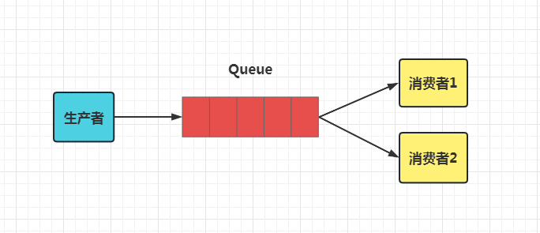
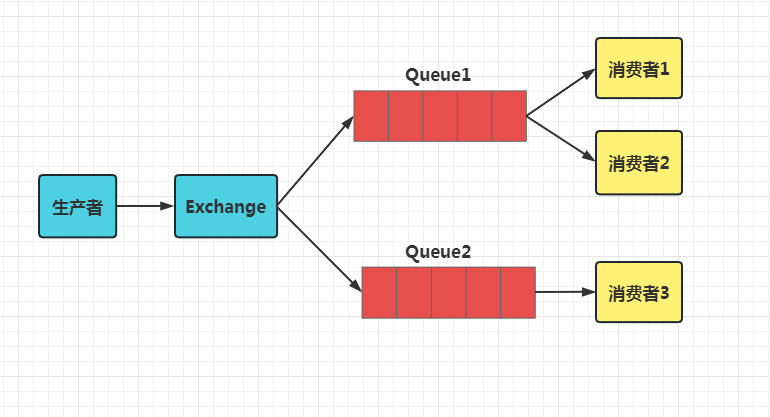
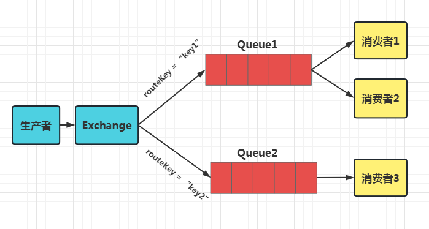
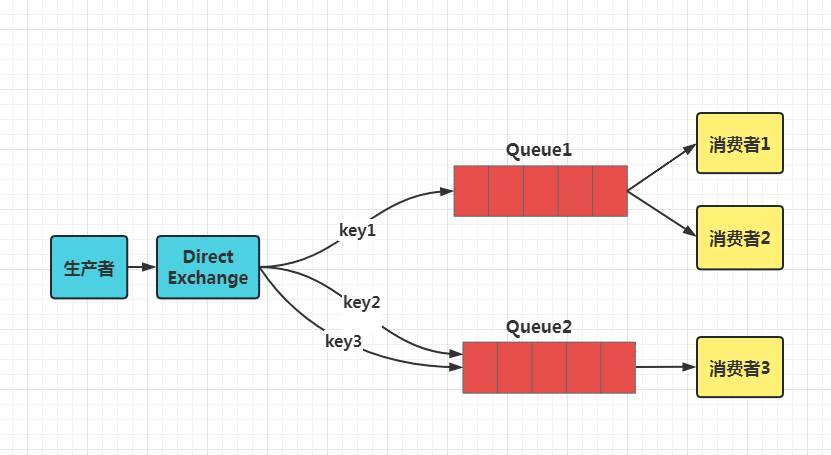
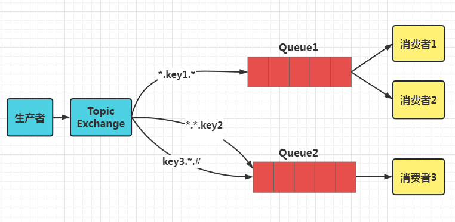
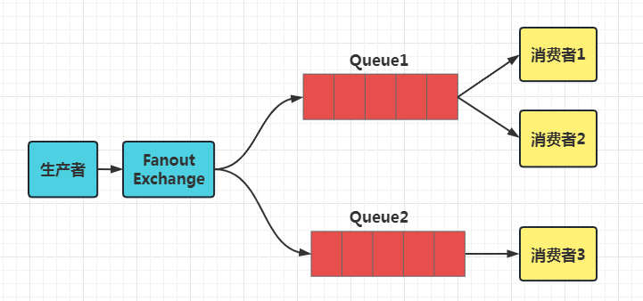

# Spring Boot 集成 RabbitMQ & 代码演示

> RabbitMQ 是实现了高级消息队列协议（AMQP）的开源消息代理软件（亦称面向消息的中间件）。
> RabbitMQ 服务器是用 Erlang 语言编写的，而集群和故障转移是构建在开放电信平台框架上的。
> 所有主要的编程语言均有与代理接口通讯的客户端库
>

## Spring-AMQP

在 Spring 生态中，提供了 [Spring-AMQP](https://spring.io/projects/spring-amqp) 项目，让我们更简便的使用 AMQP 。其官网介绍如下：
> The Spring AMQP project applies core Spring concepts to the development of AMQP-based messaging solutions. It provides a "template" as a high-level abstraction for sending and receiving messages. It also provides support for Message-driven POJOs with a "listener container". These libraries facilitate management of AMQP resources while promoting the use of dependency injection and declarative configuration. In all of these cases, you will see similarities to the JMS support in the Spring Framework.
>
> The project consists of two parts; spring-amqp is the base abstraction, and spring-rabbit is the RabbitMQ implementation.
>

## 快速入门

在 AMQP 中，Producer 将消息发送到 Exchange ，再由 Exchange 将消息路由到一个或多个 Queue 中（或者丢弃）。

Exchange 根据 Routing Key 和 Binding Key 将消息路由到 Queue 。

目前提供了 Direct、Topic、Fanout、Headers 四种类型。

## RabbitMQ 概念

### 1. Queue

**Queue:** Queue（队列）是RabbitMQ的内部对象，用于存储消息,RabbitMQ 中的消息都只能存储在 Queue 中,生产消息并最终投递到Queue中, 消费者可以从Queue中获取消息并消费

### 2. Exchange

**Exchange:** 交换器，实际上这在 RabbitMQ 中是不会生产者将消息投递到队列中，而是，生产者将消息发送到Exchange（交换器），由Exchange将消息路由到一个或多个Queue中（或者丢弃）

### 3. Routing key

**Routing key:** 生产者在将消息发送给Exchange的时候，一般会指定一个routing key，来指定这个消息的路由规则，而这个routing key需要与Exchange Type及binding
key联合使用才能最终生效。 在Exchange Type与binding key固定的情况下（在正常使用时一般这些内容都是固定配置好的），我们的生产者就可以在发送消息给Exchange时，通过指定routing key来决定消息流向哪里。
RabbitMQ为routing key设定的长度限制为255 bytes。

### 4. Binding

**Binding:** RabbitMQ中通过Binding将Exchange与Queue关联起来，这样RabbitMQ就知道如何正确地将消息路由到指定的Queue了。

### 5. Binding key

**Binding key:** 在绑定（Binding）Exchange与Queue的同时，一般会指定一个binding key；消费者将消息发送给Exchange时，一般会指定一个routing key；当binding
key与routing key相匹配时，消息将会被路由到对应的Queue中。这个将在Exchange Types章节会列举实际的例子加以说明。
在绑定多个Queue到同一个Exchange的时候，这些Binding允许使用相同的binding key。 binding key 并不是在所有情况下都生效，它依赖于Exchange
Type，比如fanout类型的Exchange就会无视binding key，而是将消息路由到所有绑定到该Exchange的Queue。

## 交换机类型

### 1. Direct Exchange

Direct 类型的 Exchange 路由规则比较简单，它会把消息路由到那些 binding key 与 routing key 完全匹配的 Queue 中

如上图
- 我们以 `routingKey="key1"` 发送消息到 Direct Exchange ，则消息会路由到 Queue1
- 我们以 `routingKey="key2"` 或者 `routingKey="key3"` 发送消息到 Direct Exchange ，则消息会路由到 Queue2
- 如果我们以其它 routingKey 发送消息，则消息不会路由到这两个 Queue 中。

### 2. Topic Exchange

Direct Exchange路由规则，是完全匹配 binding key 与routing key，但这种严格的匹配方式在很多情况下不能满足实际业务需求。 Topic Exchange 在匹配规则上进行了扩展，它与 Direct
类型的Exchange 相似，也是将消息路由到 binding key 与 routing key 相匹配的 Queue 中，但这里的匹配规则有些不同，它约定：

- routing key 为一个句点号 "." 分隔的字符串。我们将被句点号"."分隔开的每一段独立的字符串称为一个单词，例如 "pay.order.key"
- binding key 与 routing key 一样也是句点号 "." 分隔的字符串。
- binding key 中可以存在两种特殊字符 `*` 与 `#`，用于做模糊匹配。其中 `*` 用于匹配一个单词，`#` 用于匹配多个单词（可以是零个）。
  

以上图为例
- `routingKey="xx.key1.yy"` 的消息会同时路由到 Q1 。
- `routingKey="xx.key1.key2"` 的消息会同时路由到 Q1 与 Q2 。
- `routingKey="xx.yy.key2"` 的消息会路由到 Q2 。
- `routingKey="key3.xx.key2"` 的消息会路由到Q2（只会投递给 Q2 一次，虽然这个 routingKey 与 Q2 的两个 bindingKey 都匹配）。
- `routingKey="xx.yy.zz"`、`routingKey="key1"`、`routingKey="xx.key1.zz.key2"` 的消息将会被丢弃，因为它们没有匹配任何 bindingKey 。

### 3. Fanout Exchange

Fanout Exchange 路由规则非常简单，它会把所有发送到该 Exchange 的消息路由到所有与它绑定的 Queue 中

- 生产者发送到 Exchange 的所有消息都会路由到图中的两个 Queue，并最终被消费者消费。
- 总结来说，指定 Exchange ，会路由到多个绑定的 Queue 中。

### 4. Headers Exchange

Headers Exchange 不依赖于 routing key 与 binding key 的匹配规则来路由消息，而是根据发送的消息内容中的 headers 属性进行匹配。

- 在绑定 Queue 与 Exchange 时指定一组 headers 键值对。
- 当消息发送到 Exchange 时，RabbitMQ 会取到该消息的 headers（也是一个键值对的形式），对比其中的键值对是否完全匹配 Queue 与 Exchange 绑定时指定的键值对；如果完全匹配则消息会路由到该 Queue
  ，否则不会路由到该 Queue 。

## 参考

- SpringQP 官方文档：<https://docs.spring.io/spring-amqp/docs/2.1.0.RELEASE/reference/html/>
- RabbitMQ 官网：<http://www.rabbitmq.com/>