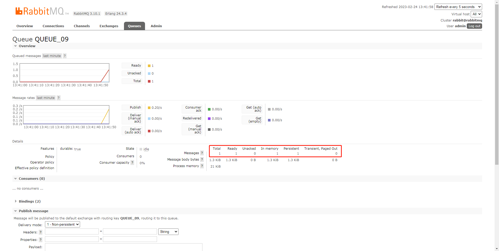

# SpringBoot 集成 RabbitMQ 批量发送 演示

批量发送消息，可以提高MQ发送性能。

但是 RabbitMQ 并没有提供了批量发送消息的 API 接口

本案例是使用 spring-amqp 的 `BatchingRabbitTemplate` 实现批量能力

`SimpleBatchingStrategy` 发送策略满足以下规则会进行发送：

- **batchSize** ：超过收集的消息数量的最大条数。
- **bufferLimit** ：超过收集的消息占用的最大内存。
- **timeout** ：超过收集的时间的最大等待时长，单位：毫秒。不过要注意，这里的超时开始计时的时间，是以最后一次发送时间为起点。也就说，每调用一次发送消息，都以当前时刻开始计时，重新到达 timeout 毫秒才算超时。

不过值得注意的是，我们一次发送十条消息到 RabbitMQ Broker 中去，在 RabbitMQ Broker 显示的也是 **1** 个消息



## 配置

```java

@Configuration
public class RabbitConfiguration {
    @Resource
    ConnectionFactory connectionFactory;

    /**
     * 注入一个批量 template
     * Spring-AMQP 通过 BatchingRabbitTemplate 提供批量发送消息的功能。如下是三个条件，满足任一即会批量发送：
     * <p>
     * 【数量】batchSize ：超过收集的消息数量的最大条数。
     * 【空间】bufferLimit ：超过收集的消息占用的最大内存。
     * 【时间】timeout ：超过收集的时间的最大等待时长，单位：毫秒。
     * 不过要注意，这里的超时开始计时的时间，是以最后一次发送时间为起点。也就说，每调用一次发送消息，都以当前时刻开始计时，重新到达 timeout 毫秒才算超时。
     *
     * @return BatchingRabbitTemplate
     */
    @Bean
    public BatchingRabbitTemplate batchRabbitTemplate() {
        // 创建 BatchingStrategy 对象，代表批量策略
        // 超过收集的消息数量的最大条数。
        int batchSize = 10;
        // 每次批量发送消息的最大内存 b
        int bufferLimit = 1024 * 1024;
        // 超过收集的时间的最大等待时长，单位：毫秒
        int timeout = 10 * 1000;
        BatchingStrategy batchingStrategy = new SimpleBatchingStrategy(batchSize, bufferLimit, timeout);
        // 创建 TaskScheduler 对象，用于实现超时发送的定时器
        TaskScheduler taskScheduler = new ConcurrentTaskScheduler();
        // 创建 BatchingRabbitTemplate 对象
        BatchingRabbitTemplate batchTemplate = new BatchingRabbitTemplate(batchingStrategy, taskScheduler);
        batchTemplate.setConnectionFactory(connectionFactory);
        return batchTemplate;
    }
}
```

## 生产者

```java

@Component
public class Producer09 {
    @Resource
    private BatchingRabbitTemplate batchingRabbitTemplate;

    public void syncSend(String id, String routingKey) {
        Message09 message = new Message09();
        message.setId(id);
        batchingRabbitTemplate.convertAndSend(Message09.EXCHANGE, routingKey, message);
    }
}
```

## 消费者

```java

@RabbitListener(queues = Message09.QUEUE)
@Component
@Slf4j
public class Consumer09 {

    @RabbitHandler
    public void onMessage(Message09 message) {
        log.info("[{}][Consumer09 onMessage][线程编号:{} 消息内容：{}]", LocalDateTime.now(), Thread.currentThread().getId(), message);
    }
}
```

## 测试

```java

@SpringBootTest
@Slf4j
class Producer09Test {
    @Resource
    Producer09 producer09;

    @Test
    void syncSend() throws InterruptedException {
        // 循环发送十个，观察消费者情况
        for (int i = 0; i < 10; i++) {
            String id = UUID.randomUUID().toString();
            producer09.syncSend(id, Message09.ROUTING_KEY);
        }
        log.info("[{}][test producer09 syncSend] 发送成功", LocalDateTime.now());
        // 测试结果是，只有等到十秒过后，或者条数达到10条才会 推送 （满足RabbitConfiguration 的配置才会发送）
        TimeUnit.SECONDS.sleep(12);
    }
}
```

感兴趣的小伙伴可以自己去测试下，满足其他条件而触发的发送