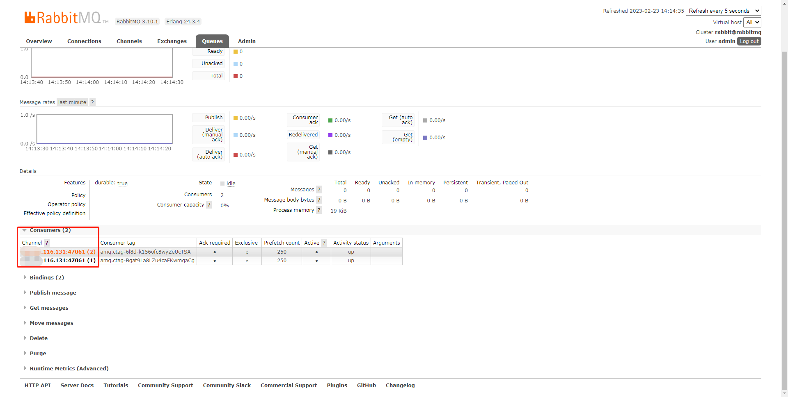

# Spring Boot + RabbitMQ 如何并发消费 演示

虽然说，我们可以通过启动多个 JVM 进程，实现多进程的并发消费，从而加速消费的速度
, 但是也可以通过配置直接开启并发消费

在 @RabbitListener 注解中，有 concurrency 属性，它可以指定并发消费的线程数。

例如说，如果设置 concurrency=2 时，Spring-AMQP 就会为该 @RabbitListener 创建 2 个线程，进行并发消费。

## 配置

```yaml
spring:
  # RabbitMQ 配置项，对应 RabbitProperties 配置类
  rabbitmq:
    host: ${REMOTE_URL:127.0.0.1}
    port: 5672
    username: admin
    password: admin
    listener:
      # 选择的 ListenerContainer 的类型。默认为 simple 类型
      type: simple
      simple:
        # 每个 @ListenerContainer 的并发消费的线程数
        concurrency: 2
        # 每个 @ListenerContainer 允许的并发消费的线程数
        max-concurrency: 10 
```

`rabbitmq.listener.type` 的枚举值可以参考   `ContainerType`

SIMPLE 对应 SimpleMessageListenerContainer 消息监听器容器。它一共有两类线程：

- Consumer 线程，负责从 RabbitMQ Broker 获取 Queue 中的消息，存储到内存中的 BlockingQueue 阻塞队列中。
- Listener 线程，负责从内存中的 BlockingQueue 获取消息，进行消费逻辑。

## 生产者

```java

@Component
public class Producer08 {
    @Resource
    private RabbitTemplate rabbitTemplate;

    public void syncSend(String id, String routingKey) {
        // 创建 Message08 消息
        Message08 message = new Message08();
        message.setId(id);
        // 同步发送消息
        rabbitTemplate.convertAndSend(Message08.EXCHANGE, routingKey, message);
    }
}
```

## 消费者

```java

@Component
// 开启并发消费
@RabbitListener(queues = Message08.QUEUE, concurrency = "2")
@Slf4j
public class Consumer08 {

    @RabbitHandler
    public void onMessage(Message08 message) throws InterruptedException {
        log.info("[{}][Consumer08 onMessage][线程编号:{} 消息内容：{}]", LocalDateTime.now(), Thread.currentThread().getId(), message);
        // 模拟消费耗时，为了让并发消费效果更好的展示
        TimeUnit.SECONDS.sleep(1);
    }
}
```

## 测试

```java

@SpringBootTest
@Slf4j
class Producer07Test {
    @Resource
    Producer07 producer07;

    @Test
    void syncSend() throws InterruptedException {
        String id = UUID.randomUUID().toString();
        producer07.syncSend(id, Message07.ROUTING_KEY);
        log.info("[{}][test producer07 syncSend][id:{}] 发送成功", LocalDateTime.now(), id);

        TimeUnit.SECONDS.sleep(2);
    }
}
```

在项目执行的时候，其实我们可在 RabbitMQ 的管理控制台，看到有两个消费者

