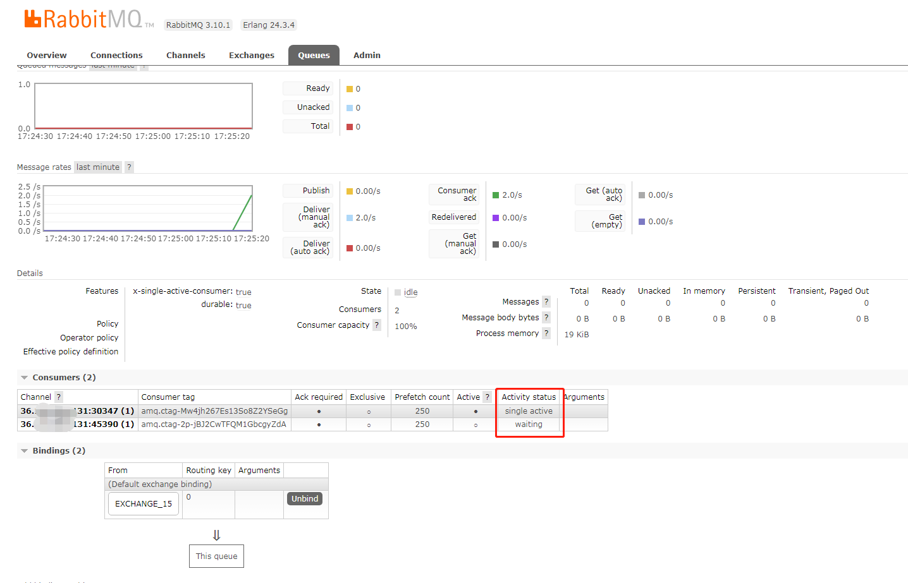

# Spring Boot + RabbitMQ 演示如何顺序消费

关键词：顺序消费、消费者单活模式、按消息键保序的思想

## 什么是顺序消费

例如：业务上产生者发送三条消息，分别是对数据的增加、修改、删除操作，如果没有保证顺序消费，执行顺序可能变成删除、修改、增加，这就乱了。

## 如何保证

一般我们讨论如何保证消息的顺序性，会从下面三个方面考虑

1. 发送消息的顺序
2. 队列中消息的顺序
3. 消费消息的顺序

### 发送消息的顺序

消息发送端的顺序，大部分业务不做要求，谁先发消息无所谓，如果遇到业务一定要发送消息也确保顺序，那意味着，只能全局加锁一个个的操作，一个个的发消息，不能并发发送消息。

### 队列中消息的顺序

RabbitMQ 中，消息最终会保存在队列中，在同一个队列中，消息是顺序的，先进先出原则，这个由 RabbitMQ 保证，通常也不需要开发关心。

> **不同队列** 中的消息顺序，是没有保证的，例如：进地铁站的时候，排了三个队伍，不同队伍之间的，不能确保谁先进站。

### 消费消息的顺序

我们说如何保证消息顺序性，通常说的就是消费者消费消息的顺序，在多个消费者消费同一个消息队列的场景，通常是无法保证消息顺序的，

虽然消息队列的消息是顺序的，但是多个消费者并发消费消息，获取的消息的速度、执行业务逻辑的速度快慢、执行异常等等原因都会导致消息顺序不一致。

例如：消息A、B、C按顺序进入队列，消费者A1拿到消息A、消费者B1拿到消息B, 结果消费者B执行速度快，就跑完了，又或者消费者A1挂了，都会导致消息顺序不一致。

解决消费顺序的问题，通常就是一个队列只有一个消费者 ,这样就可以一个个消息按顺序处理，缺点就是并发能力下降了，无法并发消费消息，这是个取舍问题。

> 如果业务又要顺序消费，又要增加并发，通常思路就是开启多个队列，业务根据规则将消息分发到不同的队列，通过增加队列的数量来提高并发度，例如：电商订单场景，只需要保证同一个用户的订单消息的顺序性就行，不同用户之间没有关系，所以只要让同一个用户的订单消息进入同一个队列就行，其他用户的订单消息，可以进入不同的队列。

## 代码设计

首先我们必须保证只有一个消费者

那么问题就来了，我们的项目一般是多副本的，如何保证只有一个副本在消费呢

这时就会用到消费者 **单活模式** `x-single-active-consumer` 

使用方式如下

```java

private Queue creatQueue(String name){
        // 创建一个 单活模式 队列
        HashMap<String, Object> args=new HashMap<>();
        args.put("x-single-active-consumer",true);
        return new Queue(name,true,false,false,args);
        }
```

创建之后，我们可以在控制台看到 消费者的激活状态



具体的代码，可以参考项目内的实现！

## 测试

测试类参考 `Producer15Test`

测试的时候时候 先启动 mock 方式。 在启动 syncSend 方法，模拟多个副本同时消费，观察是否可以

我验证是可以的啦~