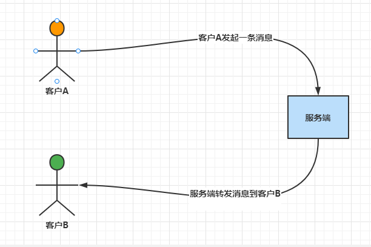
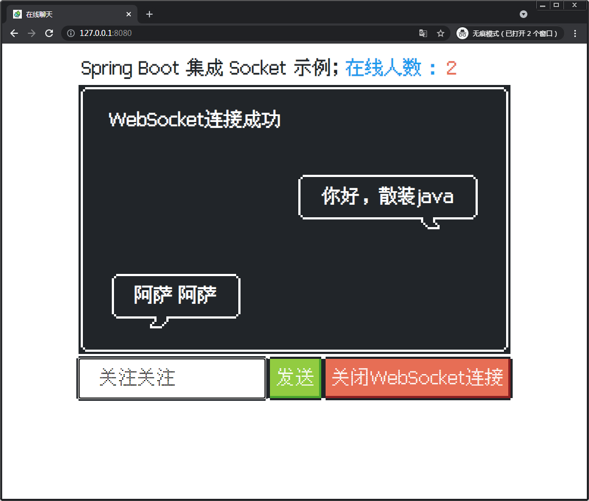

# Spring Boot 整合 socket 实现简单聊天

本示例是整合的 Tomcat WebSocket （Tomcat7 以后开始支持 websocket 协议）
> 当然也有其他的方式可以做 socket，比如说 netty


## 版本依赖

|技术栈|版本|
| ---------------- | -------------------------- |
|Spring Boot | 2.7.0 |
|Fastjson | 1.2.62 |
|NES.css [地址](https://nostalgic-css.github.io/NES.css/) |2.3.0|
|Maven|3.8.3|
## 思路

首先要明白，实现一个聊天功能，是要有一个客户端和一个服务端的，

客户端对应的就是页面，每个客户都会在页面上聊天

服务端对应的就是后台，接收到客户端发来的消息后，进行转发（这里可以进行其他的业务逻辑），发送给其他的客户端，这样就可以实现聊天的功能。

流程可以简单描述如下



## 项目启动 & 效果展示
运行启动类即可 `BulkSocketApplication` 

启动后访问 <http://127.0.0.1:8080/> 即可体验

可以开多个窗口，互相聊天



## 集成步骤
### 1. 引入必要的依赖
```xml
<!-- 引入 socket -->
<dependency>
    <groupId>org.springframework.boot</groupId>
    <artifactId>spring-boot-starter-websocket</artifactId>
</dependency>
<!-- 引入 Fastjson ，实现序列化使用  -->
<dependency>
    <groupId>com.alibaba</groupId>
    <artifactId>fastjson</artifactId>
    <version>1.2.62</version>
</dependency>
<dependency>
    <groupId>org.springframework.boot</groupId>
    <artifactId>spring-boot-starter-thymeleaf</artifactId>
</dependency>
<dependency>
    <groupId>org.springframework.boot</groupId>
    <artifactId>spring-boot-starter-web</artifactId>
</dependency>
```

### 2. 配置
注入 `ServerEndpointExporter` , 方便对于后续的注解 `@ServerEndpoint()` 的支持

```java
@Configuration
public class WebSocketConfiguration {
    /**
     * 给 spring 容器注入这个 ServerEndpointExporter对象
     * <p>
     * 这个bean会检测所有带有 @serverEndpoint 注解的 bean 并注册他们。
     * ps：
     * 如果使用的是外置的 Tomcat 容器，则不需要自己提供 ServerEndpointExporter，因为它将由 Tomcat 容器自己提供和管理。
     *
     * @return ServerEndpointExporter
     */
    @Bean
    public ServerEndpointExporter serverEndpointExporter() {
        return new ServerEndpointExporter();
    }
}
```
### 3. 编写服务端代码
编写服务端的代码，通过 `@ServerEndpoint` 注解控制访问的路径，通过 `@OnOpen` 、`@OnClose` 、`@OnMessage` 、 `@OnError` 等注解
实现对于客户的相关行为做监听。
```java
@Component
@ServerEndpoint("/chat")
@Slf4j
public class WebSocketServer {

    /**
     * 连接建立成功调用的方法
     */
    @OnOpen
    public void onOpen(Session session) {
        log.info("===> onOpen:{}", session.getId());
        // 上线，并且通知到其他人
        WebSocketContext.add(session, session.getId());
        WebSocketContext.countNotice();
    }

    /**
     * 连接关闭调用的方法
     */
    @OnClose
    public void onClose(Session session) {
        log.info("===> onClose:{}", session.getId());
        // 下线，并且通知到其他人
        WebSocketContext.remove(session);
        WebSocketContext.countNotice();
    }

    /**
     * 收到客户端消息后调用的方法
     *
     * @param message 客户端发送过来的消息
     */
    @OnMessage
    public void onMessage(String message, Session session) {
        log.info("===> onMessage:{},message:{}", session.getId(), message);
        // 进行消息的转发，同步到其他的客户端上
        ChatMsgMessage msg = JSON.parseObject(message, ChatMsgMessage.class);
        WebSocketContext.broadcast(MsgTypeEnum.CHAT_MSG.getCode(), msg, session);
    }

    /**
     * 监听错误
     *
     * @param session session
     * @param error   错误
     */
    @OnError
    public void onError(Session session, Throwable error) {
        log.error("SessionId:{},出现异常：{}", session.getId(), error.getMessage());
        error.printStackTrace();
    }
```
### 4. socket 发送核心上下文类编写
本类中包含客户端映射关系的管理，以及实际的发送逻辑代码
```java
@Slf4j
public class WebSocketContext {

    /**
     * Session 与用户的映射
     */
    private static final Map<Session, String> SESSION_USER_MAP = new ConcurrentHashMap<>();
    /**
     * 用户与 Session 的映射
     */
    private static final Map<String, Session> USER_SESSION_MAP = new ConcurrentHashMap<>();

    /**
     * 添加 Session 在这个方法中，会绑定用户和 Session 之间的映射
     *
     * @param session Session
     * @param user    用户
     */
    public static void add(Session session, String user) {
        // 更新 USER_SESSION_MAP , 这里的 user 正常来讲应该是具体的用户(id)，而不是单纯的 session.getId()
        USER_SESSION_MAP.put(user, session);
        // 更新 SESSION_USER_MAP
        SESSION_USER_MAP.put(session, user);
    }

    /**
     * 移除 Session
     *
     * @param session Session
     */
    public static void remove(Session session) {
        // 从 SESSION_USER_MAP 中移除
        String user = SESSION_USER_MAP.remove(session);
        // 从 USER_SESSION_MAP 中移除
        if (user != null && user.length() > 0) {
            USER_SESSION_MAP.remove(user);
        }
    }


    /**
     * 广播发送消息给所有在线用户
     *
     * @param type    消息类型
     * @param message 消息体
     * @param <T>     消息类型
     * @param me      当前消息的发送者，不会将消息发送给自己
     */
    public static <T extends Message> void broadcast(String type, T message, Session me) {
        // 创建消息
        String messageText = buildTextMessage(type, message);
        // 遍历 SESSION_USER_MAP ，进行逐个发送
        for (Session session : SESSION_USER_MAP.keySet()) {
            if (!session.equals(me)) {
                sendTextMessage(session, messageText);
            }
        }
    }

    /**
     * 发送消息给单个用户的 Session
     *
     * @param session Session
     * @param type    消息类型
     * @param message 消息体
     * @param <T>     消息类型
     */
    public static <T extends Message> void send(Session session, String type, T message) {
        // 创建消息
        String messageText = buildTextMessage(type, message);
        // 遍历给单个 Session ，进行逐个发送
        sendTextMessage(session, messageText);
    }

    /**
     * 发送消息给指定用户
     *
     * @param user    指定用户
     * @param type    消息类型
     * @param message 消息体
     * @param <T>     消息类型
     * @return 发送是否成功
     */
    public static <T extends Message> boolean send(String user, String type, T message) {
        // 获得用户对应的 Session
        Session session = USER_SESSION_MAP.get(user);
        if (session == null) {
            log.error("==> user({}) 不存在对应的 session", user);
            return false;
        }
        // 发送消息
        send(session, type, message);
        return true;
    }

    /**
     * 构建完整的消息
     *
     * @param type    消息类型
     * @param message 消息体
     * @param <T>     消息类型
     * @return 消息
     */
    private static <T extends Message> String buildTextMessage(String type, T message) {
        JSONObject messageObject = new JSONObject();
        messageObject.put("type", type);
        messageObject.put("body", message);
        return messageObject.toString();
    }

    /**
     * 真正发送消息
     *
     * @param session     Session
     * @param messageText 消息
     */
    private static void sendTextMessage(Session session, String messageText) {
        if (session == null) {
            log.error("===> session 为 null");
            return;
        }
        RemoteEndpoint.Basic basic = session.getBasicRemote();
        if (basic == null) {
            log.error("===> session.basic 为 null");
            return;
        }
        try {
            basic.sendText(messageText);
        } catch (IOException e) {
            log.error("===> session: {} 发送消息: {} 发生异常", session, messageText, e);
        }
    }

    /**
     * 在线人数通知
     */
    public static void countNotice() {
        Integer count = SESSION_USER_MAP.size();
        ChatCountMessage message = new ChatCountMessage();
        message.setCount(count);
        broadcast(MsgTypeEnum.CHAT_COUNT.getCode(), message, null);
    }
```

### 5. 编写客户端代码（前端页面）
这里前端页面使用浏览器自带的 webSocket 进行链接访问。
通过 `new WebSocket("ws://127.0.0.1:8080/chat");` 来实现功能。
并通过响应的监听方法实现监听，进而通信。
```html
<script type="text/javascript">
    let websocket = null;
    //判断当前浏览器是否支持WebSocket
    if ('WebSocket' in window) {
        //改成你的地址
        websocket = new WebSocket("ws://127.0.0.1:8080/chat");
    } else {
        alert('当前浏览器不支持 websocket')
        throw "当前浏览器不支持 websocket"
    }

    //连接发生错误的回调方法
    websocket.onerror = function () {
        setMessageInnerHTML("WebSocket连接发生错误" + "&#13;");
    };

    //连接成功建立的回调方法
    websocket.onopen = function () {
        setMessageInnerHTML("WebSocket连接成功" + "&#13;");
    }
    //接收到消息的回调方法
    websocket.onmessage = function (event) {
        let jsonData = event.data;
        let data = JSON.parse(jsonData);
        console.log("收到消息==", event);
        if (data.type === "1") {
            let msg = otherPersonShowMsg(data.body.msg)
            setMessageInnerHTML(msg);
        }
        if (data.type === "2") {
            setChatCountInnerHTML(data.body.count)
        }
    }

    //连接关闭的回调方法
    websocket.onclose = function () {
        setMessageInnerHTML("WebSocket连接关闭" + "&#13;");
    }

    //监听窗口关闭事件，当窗口关闭时，主动去关闭websocket连接，防止连接还没断开就关闭窗口，server端会抛异常。
    window.onbeforeunload = function () {
        closeWebSocket();
    }

    //将消息显示在网页上
    function setMessageInnerHTML(innerHTML) {
        document.getElementById('message').innerHTML += innerHTML;
    }

    //将消息显示在网页上
    function setChatCountInnerHTML(innerHTML) {
        document.getElementById('count').innerHTML = innerHTML;
    }

    //关闭WebSocket连接
    function closeWebSocket() {
        websocket.close();
        setChatCountInnerHTML(0)
    }

    //发送消息
    function send() {
        var message = document.getElementById('text').value;
        websocket.send('{"msg":"' + message + '"}');
        document.getElementById('text').value = '';
        message = this.meShowMsg(message);
        setMessageInnerHTML(message);
    }

    // 显示别人发送的消息
    function otherPersonShowMsg(str) {
        return ` <section class="message-left">
                  <i class="nes-bcrikko"></i>
                  <div class="nes-balloon from-left is-dark" style="padding: .2rem 1rem !important;">
                    <p>${str}</p>
                  </div>
                </section>`
    }

    // 显示自己发送的消息
    function meShowMsg(str) {
        return ` <section class="message-right">
                    <div class="nes-balloon from-right is-dark" style="padding: .2rem 1rem !important;">
                      <p>${str}</p>
                    </div>
                    <i class="nes-bcrikko"></i>
              </section>`
    }
</script>
```
